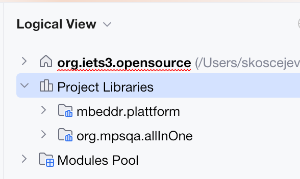

# Libraries in Project View

This is a simple plugin to show (project) libraries under a separate node in the project view:

## Building

The project is currently very small and does not have external dependencies. To keep things simple, only MPS and Ant are
used for building. The main build script is `build.xml`, generated from the `com.spclngs.projectlibs` MPS build project.
Whenever the build project or module dependencies are changed, the build script must be manually regenerated
and committed.

To build the project, open it in MPS, rebuild it to generate sources and compile all modules, and execute the build
script to assemble the plugin zip.
